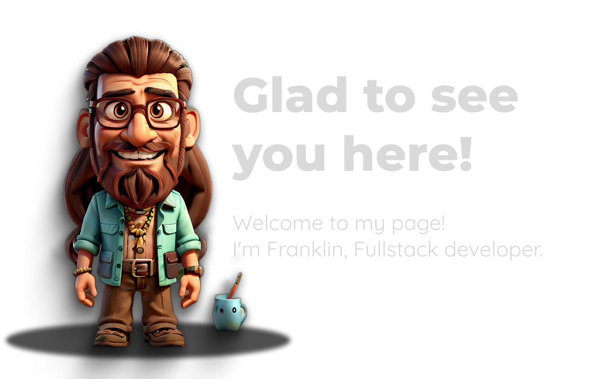
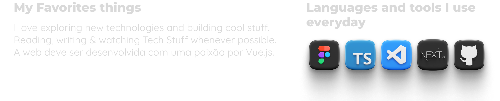
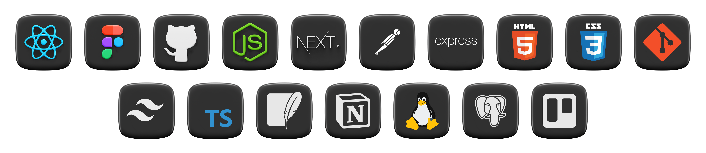

#

#

#

# _My Journey_

- Much like many others, my professional path has been shaped by a multitude of experiences in various fields. However, it was in web development that I discovered my true calling, a challenge that fuels my motivation and drives me to continuous growth.

### _My Absolute Favorites:_

-  &nbsp; I love exploring new technologies and building cool stuff.

-  &nbsp; Immerse myself in the sights, sounds, and sensations of nature: the ocean breeze, the crashing waves, the rustling leaves, and the birdsong.

-  &nbsp; Cycling/walking to clear the mind and soothe the soul.

-  &nbsp; To nurture my creativity and stimulate my mind with knowledge, including language learning. I'm currently studying English, Russian, and French.

 

  <code>&nbsp;_Let's talk_***...***&nbsp;</code> 
  

#

  
<b> 𝗠𝘆 𝗧𝗲𝗰𝗸 𝗦𝘁𝗮𝗰𝗸</b>

   

#

  
<b> Github Streaks</b>

   
  
  

#

  <strong>Show some  by starring some of the repositories!</strong> 

