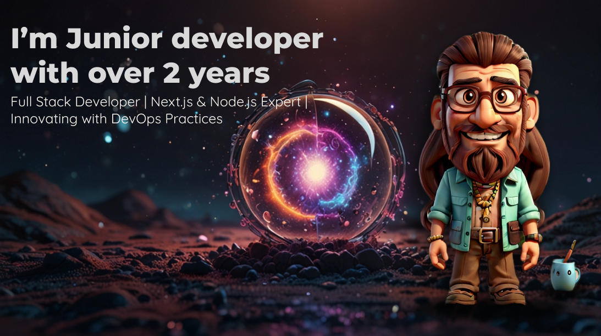

## **_Hello, Welcome!_**  

Hi there! I am a full-stack developer passionate about technology and innovation. My mission is to create solutions that simplify people's lives and bring positive impact. With over 2 years of experience, I focus on building robust applications and interfaces that provide an incredible user experience.

---

---

### _My Absolute Favorites:_

-    Exploring new technologies and building cool stuff.  

-    Immersing myself in the sights, sounds, and sensations of nature: the ocean breeze, crashing waves, rustling leaves, and birdsong.  

-    Cycling and walking to clear my mind and soothe my soul.  

-    Nurturing my creativity and stimulating my mind with knowledge, including language learning. I am currently improving my english pronunciation. 

---

### 🌱 **_I’m Currently Learning:_**  
- 🛠️ **Golang**: Creating scalable and efficient web services.  
- 📱 **React Native**: Developing mobile applications.  
- 🚀 **NestJS**: Exploring enterprise-level back-end frameworks.  

---

### 🌟 **_Ongoing Project: Solar Monitor App_**  
An application to help users monitor and estimate solar radiation in their region, providing insights about energy consumption and solar energy feasibility.  

#### **Key Features:**  
- 📊 **Solar radiation estimation** based on the user’s location.  
- 🗓️ **Easy scheduling**: Integration with **Google Calendar** allows users to choose an available time for a technical visit.  
- 🗺️ **Interactive maps**: Using **Mapbox** to display routes and calculate the most efficient path to the customer’s location.  
- 🤝 **Confirmation and tracking**: The company confirms the time, and the app provides detailed scheduling and route information.  

#### **Technologies Used:**  
- 🔗 **Back-End**: **NestJS** and **Node.js**  
- 🖼️ **Front-End**: **React Native**  
- 📡 **Mapping APIs**: **Mapbox**  
- 📅 **Scheduling**: **Google Calendar API**  

---

> **Find me**
 

  📧 <a href="mailto:frankmcdias@gmail.com">frankmcdias@gmail.com</a>  
  🔗 <a href="https://www.linkedin.com/in/franklin-md/">LinkedIn</a>  
  🌍 Brazil  

  

---

###  Languages and Tools:  
<!-- 
 -->

   
  
                          

<!-- 
   -->

---

<!-- 
 -->
  
<b> Github Streaks</b>

  

    
  

<!-- 
 -->

---

---
